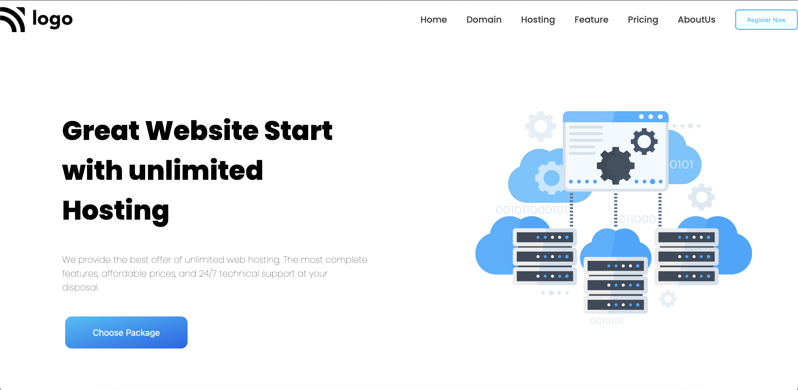

# Assignment 1

## PROJECT 11 - [LINK ](https://liveproj-11.netlify.app/)

-   Skills Gained in this project
    -   Learned to use svgs .
    -   while adding responsiveness to the site, I learned to use order 
    -   learned where to add the ul (Unorder List)

## Time taken to finish this project

-   4.5 hour taken to complete it.

